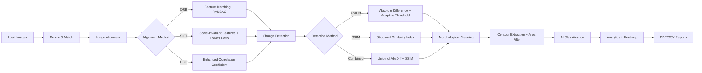

# 🛰️ SENTINEL — Satellite Change Detection System

<div align="center">


**A professional-grade desktop application for detecting, classifying, and analyzing changes in satellite imagery using advanced computer vision and machine learning.**

[Features](#-features) •
[Tech Stack](#-tech-stack) •
[Installation](#-getting-started) •
[Architecture](#-architecture) •
[Usage](#-usage-guide) •
[Contributing](#-contributing)

</div>

---

## 🎯 Problem Statement

Satellite imagery is critical for monitoring urban development, environmental changes, natural disasters, and agricultural patterns. Manual comparison of before-and-after satellite images is time-consuming and error-prone. **SENTINEL** automates this process using computer vision algorithms to detect, classify, and quantify changes — producing professional reports suitable for environmental monitoring, urban planning, and disaster response.

---

## ✨ Features

<table>
<tr>
<td width="50%">

### 🔍 Detection Engine
- **Multi-Method Alignment**: ORB, SIFT, ECC registration with auto quality scoring
- **Advanced Detection**: Absolute Difference, SSIM (Structural Similarity), Combined
- **Sensitivity Control**: Fine-tuned threshold slider (1-100)
- **Noise Filtering**: Configurable minimum contour area

</td>
<td width="50%">

### 🤖 AI Classification
- **Automatic Type Detection**: Uses HSV color analysis + contour geometry
- **5 Change Categories**: Construction, Vegetation, Water, Demolition, Other
- **Confidence Scoring**: Per-change confidence metric (0-100%)
- **Color-Coded Bounding Boxes**: Each type has distinct visualization

</td>
</tr>
<tr>
<td>

### 📊 Analytics & Visualization
- **6 View Modes**: Annotated, Heatmap, Before, After, Mask, Side-by-Side
- **4 Interactive Charts**: Area histogram, Type pie chart, Density grid, Confidence plot
- **JET Heatmap Overlay**: Change intensity visualization
- **8×8 Density Grid**: Spatial change concentration analysis

</td>
<td>

### 📄 Professional Reporting
- **PDF Reports**: Multi-page documents with images, tables, and statistics
- **CSV Export**: Structured data with classification labels
- **Image Export**: Save annotated results or heatmaps as PNG/JPG
- **Automatic Logging**: All detections saved to CSV history

</td>
</tr>
<tr>
<td>

### 🖥️ Modern Desktop GUI
- **Dark/Light Themes**: CustomTkinter with appearance mode toggle
- **5-Tab Navigation**: Dashboard, Detection, Analytics, History, Settings
- **Progress Tracking**: Real-time progress bar during detection
- **Threaded Processing**: Non-blocking UI during analysis

</td>
<td>

### ⚙️ Configuration
- **3 Alignment Methods**: ORB (fast), SIFT (accurate), ECC (sub-pixel)
- **3 Detection Methods**: AbsDiff, SSIM, Combined
- **UI Scaling**: 80% to 120%
- **Persistent History**: Scrollable log of all past sessions

</td>
</tr>
</table>

---

## 🛠️ Tech Stack

| Technology | Version | Purpose |
|-----------|---------|---------|
| **Python** | 3.10+ | Core language |
| **OpenCV (contrib)** | 4.13 | SIFT/ORB/ECC alignment, image processing, contour detection |
| **scikit-image** | 0.26 | SSIM (Structural Similarity Index) computation |
| **scikit-learn** | 1.8 | KMeans clustering for change classification |
| **Matplotlib** | 3.10 | Embedded interactive charts and heatmap visualizations |
| **CustomTkinter** | 5.2 | Modern dark-themed desktop GUI framework |
| **Pillow** | 11.2 | Image format conversion (CV2 ↔ PIL ↔ Tk) |
| **ReportLab** | 4.5 | Professional PDF report generation |
| **NumPy** | 2.3 | Array operations and statistical computations |

---

## 🚀 Getting Started

### Prerequisites
- Python 3.10 or higher
- pip package manager

### Installation

```bash
# Clone the repository
git clone https://github.com/Vasu-Nandan20/satellite-change-detection.git
cd satellite-change-detection

# Create virtual environment (recommended)
python -m venv .venv
.venv\Scripts\activate        # Windows
# source .venv/bin/activate   # macOS/Linux

# Install dependencies
pip install -r requirements.txt

# Run the application
python app.py
```

---

## 📖 Usage Guide

### Step 1: Launch
```bash
python app.py
```
The application opens with the **Dashboard** tab showing system stats and feature highlights.

### Step 2: Load Images
Navigate to the **Detection** tab and select:
- **Before Image** — reference satellite image (earlier timestamp)
- **After Image** — target satellite image (later timestamp)

### Step 3: Configure Settings
- **Alignment Method**: ORB (fast), SIFT (high accuracy), ECC (sub-pixel precision)
- **Detection Method**: Absolute Difference, SSIM, or Combined
- **Sensitivity**: Slide from 1 (low) to 100 (high sensitivity)
- **Min Area**: Filter out small noise (default: 100 pixels)

### Step 4: Run Detection
Click **🚀 Run Detection** — the pipeline runs on a background thread:
1. Image resizing & normalization
2. Feature-based alignment
3. Change detection & thresholding
4. Morphological cleaning
5. Contour extraction & classification
6. Analytics computation

### Step 5: Explore Results
Switch between **6 view modes**:
| Mode | Description |
|------|-------------|
| Annotated | Color-coded bounding boxes with type labels |
| Heatmap | JET colormap overlay showing change intensity |
| Before | Original reference image |
| After | Aligned target image |
| Mask | Binary change mask |
| Side-by-Side | Before and annotated images side by side |

### Step 6: Export
- **📄 PDF** — Professional multi-page report with images and tables
- **📊 CSV** — Structured data export
- **💾 Image** — Save current view as PNG/JPG

---

## 🏗️ Architecture

```
satellite-change-detection/
├── app.py                        # Application entry point
├── engine/                       # Computer Vision pipeline
│   ├── alignment.py              # ORB/SIFT/ECC image registration
│   ├── detector.py               # AbsDiff/SSIM/Combined detection
│   ├── classifier.py             # Change type classification (HSV + geometry)
│   └── analyzer.py               # Statistics, heatmaps, density grids
├── gui/                          # CustomTkinter interface
│   ├── app_window.py             # Main window + sidebar navigation
│   ├── dashboard_frame.py        # Welcome dashboard with stats
│   ├── detection_frame.py        # Core detection workflow
│   ├── analytics_frame.py        # Embedded matplotlib charts
│   ├── history_frame.py          # Past detections log viewer
│   └── settings_frame.py         # Appearance & configuration
├── utils/                        # Shared utilities
│   ├── image_utils.py            # Image conversion helpers
│   └── report_generator.py       # PDF & CSV report generation
├── docs/                         # Documentation
│   └── ARCHITECTURE.md           # Detailed architecture docs
├── .github/                      # GitHub templates
│   └── ISSUE_TEMPLATE/           # Bug report & feature request templates
├── before.jpg                    # Sample before image
├── after.jpg                     # Sample after image
├── requirements.txt              # Python dependencies
├── LICENSE                       # MIT License
├── CHANGELOG.md                  # Version history
├── CONTRIBUTING.md               # Contribution guidelines
├── CODE_OF_CONDUCT.md            # Community standards
└── SECURITY.md                   # Security policy
```

### Design Patterns Used
- **MVC (Model-View-Controller)** — Engine (Model), GUI Frames (View), Detection Frame (Controller)
- **Strategy Pattern** — Pluggable alignment and detection algorithms
- **Observer Pattern** — Detection results propagated to Analytics frame

> 📘 See [docs/ARCHITECTURE.md](docs/ARCHITECTURE.md) for detailed pipeline flowcharts, threading model, and classification algorithm documentation.

---

## 🔧 Detection Pipeline



---

## 📊 Classification System

Changes are automatically classified using **HSV color analysis**, **brightness delta**, and **contour geometry**:

| Type | Detection Logic | Indicators |
|------|----------------|------------|
| 🏗️ **Construction** | Brightness increase > 20, regular aspect ratio | New buildings, roads, infrastructure |
| 🌿 **Vegetation Change** | Green hue shift (HSV H: 35-85, S > 40) | Deforestation, reforestation, crop changes |
| 💧 **Water Change** | Blue hue shift (HSV H: 90-130, S > 30) | Flooding, lake expansion, drought |
| 🏚️ **Demolition** | Brightness decrease > 20 | Building removal, land clearing |
| ❓ **Other** | Unclassified changes | Misc. terrain or atmospheric changes |

---

## 🗺️ Roadmap

- [x] Multi-method image alignment (ORB, SIFT, ECC)
- [x] SSIM-based structural change detection
- [x] AI-powered change classification
- [x] Heatmap visualization and density analysis
- [x] Professional PDF/CSV report generation
- [x] Modern dark-themed CustomTkinter GUI
- [ ] Deep learning classification (CNN-based)
- [ ] Batch processing for multiple image pairs
- [ ] GeoTIFF support with coordinate overlay
- [ ] Cloud deployment with web interface
- [ ] Time-series analysis for multi-temporal datasets

---

## 🤝 Contributing

Contributions are welcome! Please see our [Contributing Guidelines](CONTRIBUTING.md) for details.

1. Fork the repository
2. Create a feature branch (`git checkout -b feature/amazing-feature`)
3. Commit your changes (`git commit -m 'feat: add amazing feature'`)
4. Push to the branch (`git push origin feature/amazing-feature`)
5. Open a Pull Request

---

## 📄 License

This project is licensed under the MIT License — see the [LICENSE](LICENSE) file for details.

---

## 🙏 Acknowledgements

- [OpenCV](https://opencv.org/) — Computer vision library
- [scikit-image](https://scikit-image.org/) — Image processing in Python
- [scikit-learn](https://scikit-learn.org/) — Machine learning library
- [CustomTkinter](https://github.com/TomSchimansky/CustomTkinter) — Modern Python UI library
- [Matplotlib](https://matplotlib.org/) — Visualization library
- [ReportLab](https://www.reportlab.com/) — PDF generation toolkit

---

<div align="center">

**Built with ❤️ by [Vasu Nandan](https://github.com/Vasu-Nandan20)**

⭐ Star this repo if you find it useful!

</div>
